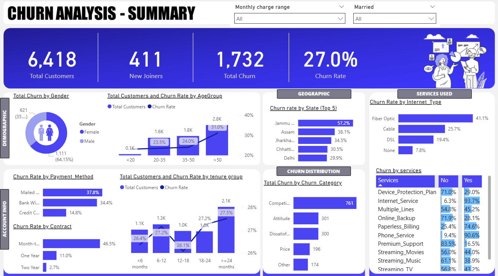
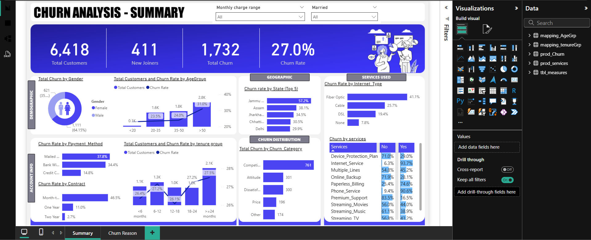

# Telco Customer Churn Analysis & Prediction

## Project Overview
This is an end-to-end Customer Churn Analysis & Prediction project that leverages **SQL Server** for ETL and data processing, **Python (Machine Learning & Streamlit)** for predictive modeling and interactive dashboards, and **Power BI** for executive-level visualization.

## Business Problem
In the telecommunications industry, customer retention is often more cost-effective than customer acquisition. This project addresses the challenge of identifying customers who are likely to churn, understanding why they leave, and providing a tool for proactive retention strategies.

## Technology Stack
- **Database:** SQL Server (T-SQL)
- **Data Processing:** Python (Pandas, NumPy)
- **Machine Learning:** Scikit-Learn (Random Forest Classifier)
- **Web App:** Streamlit (Python)
- **Visualization:** Power BI
- **Documentation:** Markdown

## Data Pipeline Architecture
```text
Raw Customer Data
        ↓
SQL Server ETL & Cleaning
        ↓
Database Views
        ↓
Python ML Model (Random Forest)
        ↓
Interactive Streamlit Dashboard & Churn Predictions
        ↓
Power BI Executive Dashboard
        ↓
Business Insights & Retention Strategy
```

## Machine Learning & Web App
- **Predictive Model:** A Random Forest Classifier was trained to predict churn based on customer demographics and service usage.
- **Streamlit Dashboard:** An interactive web application was developed to allow users to explore churn drivers and run real-time churn predictions for individual customers.

## Dashboard Features
- **Executive Summary:** High-level metrics (Churn Rate, Total Revenue, Customer count).
- **Churn Driver Analysis:** Insights into contract types, internet services, and tenure impact.
- **Geographic Insights:** Churn distribution across different states.
- **Real-time Prediction:** Interactive sliders and inputs to predict the probability of churn for a specific customer profile.

## Key Insights
- **Contract Type:** Customers on month-to-month contracts exhibit the highest churn rates.
- **Service Type:** Fiber optic internet service users churn more frequently compared to DSL users.
- **Tenure:** Churn risk decreases significantly after the first 12 months of tenure.

## How to Run
1. **Database Setup:** Execute `SQL/database_schema.sql` and `SQL/data_cleaning.sql` in your SQL Server instance.
2. **ML Model & Dashboard:** 
   - Install dependencies: `pip install -r Python/requirements.txt`
   - Run the Streamlit app: `streamlit run Python/churn_prediction.ipynb` (or `.py`)
3. **Visualization:** Open `PowerBI/Telco_Churn_Dashboard.pbix` (ensure the data source points to your local SQL Server instance).

## Dashboard Screenshots

### Executive Churn Dashboard (Power BI)


### Churn Prediction & Analysis Tool (Streamlit)


---

**Developed by:** Abhijeet Gore  
**Role:** Data Scientist / Data Analyst
